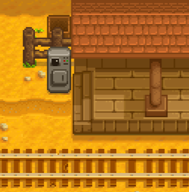
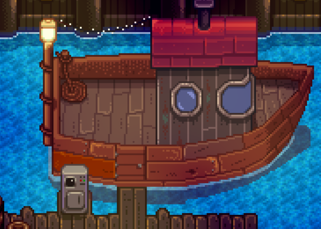

**Train Station** lets players travel to other mods' destinations by boat or train by interacting with ticket machines
at the railroad, Willy's shop, or optionally other mods' locations.

Mod authors can add custom destinations with optional ticket prices, and can add an automatic rail station to their own
maps using a map property.

## Contents
* [For players](#for-players)
  * [Buy a ticket](#buy-a-ticket)
  * [Compatibility](#compatibility)
* [For mod authors](#for-mod-authors)
  * [Add a destination](#add-a-destination)
  * [Add a train station](#add-a-train-station)
* [See also](#see-also)

## For players
### Buy a ticket
To take the train, walk to the railroad and buy a ticket from the machine next to the station:  


To take the boat, enter [Willy's back room](https://stardewvalleywiki.com/Fish_Shop#Willy.27s_Boat)
and interact with the ticket machine there once it's been repaired:  


You can also interact with ticket machines in various mod locations.

### Compatibility
The ticket station and the warp to the railroad may end up somewhere invalid if a map mod changes the shape of the map.
If so, you can adjust those coordinates in the `config.json` file:
```js
{
  "TicketStationX": 32,
  "TicketStationY": 40,
  "RailroadWarpX": 32,
  "RailroadWarpY": 42
}
```

## For mod authors
### Add a destination
To add a destination to the boat or train menu:

1. Create a [Content Patcher content pack](https://stardewvalleywiki.com/Modding:Content_Patcher) if you don't already
   have one.
2. In your `content.json`, add entries to the `Mods/Cherry.TrainStation/Destinations` asset:
   ```js
   {
       "Action": "EditData",
       "Target": "Mods/Cherry.TrainStation/Destinations",
       "TargetField": [ "TrainStops" ], // or BoatStops
       "Entries": {
           "{{ModId}}_ClintShop": { // should match your Id field below
               "Id": "{{ModId}}_ClintShop",
               "DisplayName": "Clint's Shop",
               "ToLocation": "Town",
               "ToTile": { "X": 105, "Y": 80 },
               "ToFacingDirection": "down"
           }
       }
   }
   ```
3. Edit the data accordingly. You can list any number of boat or train stops in the same `EditData` patch.

The available fields for a boat or train stop are:

field name          | usage
------------------- | -----
`Id`                | A [unique string ID](https://stardewvalleywiki.com/Modding:Common_data_field_types#Unique_string_ID) for your destination. This should be prefixed with `{{ModId}}_`.
`DisplayName`       | The display name to show in the menu. This should usually be translated into the player's current language using Content Patcher's `i18n` token.
`ToLocation`        | The internal name of the location to which the player should be warped to. You can see internal location names in-game using [Debug Mode](https://www.nexusmods.com/stardewvalley/mods/679).
`ToTile`            | The tile position to which the player should be warped to. You can see tile coordinates in-game using [Debug Mode](https://www.nexusmods.com/stardewvalley/mods/679).
`ToFacingDirection` | _(Optional)_ The direction the player should face after warping. The possible values are `up`, `down`, `left`, and `right`. Default `down`.
`Cost`              | _(Optional)_ The gold price to purchase a ticket. Default free.
`Conditions`        | _(Optional)_ If set, the [game state query](https://stardewvalleywiki.com/Modding:Game_state_queries) which must be met for the destination to appear in the menu.

> [!TIP]
> In older versions of Train Station, you needed a separate content pack for Train Station instead of using Content
> Patcher per the above. That's no longer needed, but those legacy content packs will continue working as-is if you
> already have one.

### Add a ticket machine
To add a train ticket machine to a custom map:

1. Add the desired sprites to the map (e.g. the ticket machine).
2. Add an `Action: BoatTicket` or `Action: TrainStation` [map property](https://stardewvalleywiki.com/Modding:Maps) on
   the `Buildings` layer where the player can activate it.

When the player clicks the tile with the `Action` property, they'll see the UI to choose a boat or ticket destination.
The menu will automatically hide destinations in their current location.

## See also
* [Release notes](release-notes.md)
